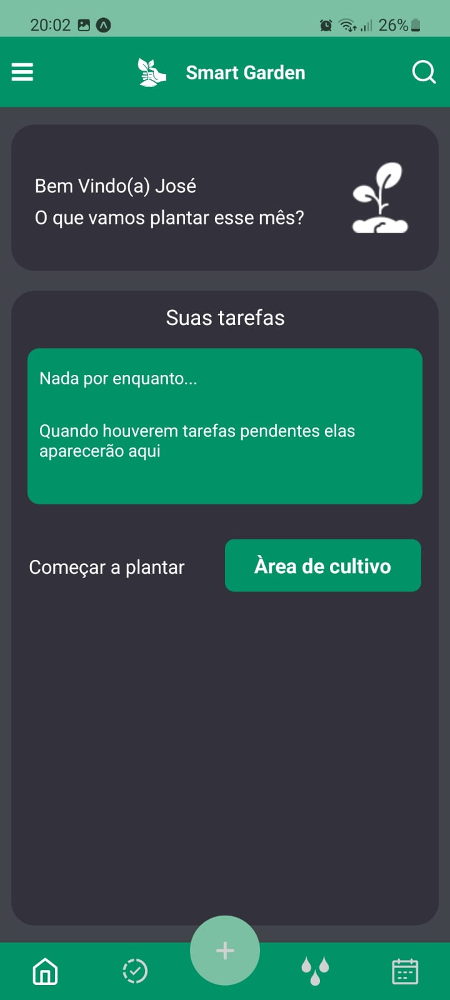
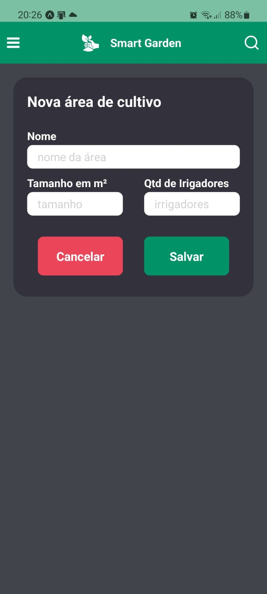
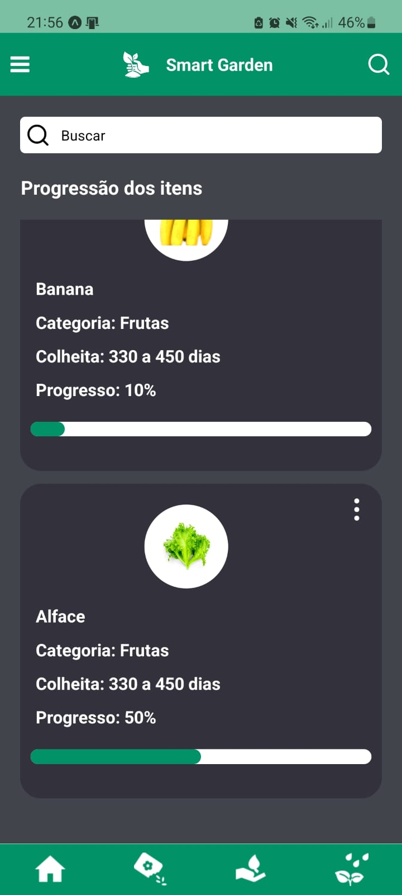

# 🌿 SmartGarden: Sistema Mobile para Controle de Cultivo

## 💡 Descrição do Projeto

Essa é a versão Mobile do projeto **SmartGarden** desenvolvido com **React Native e Expo**, projetado para simplificar ainda mais o controle e gerenciamento de atividades de cultivo e plantio.

## Algumas imagens do projeto
### Tela Inicial

### Nova Área

### Progressão dos itens

